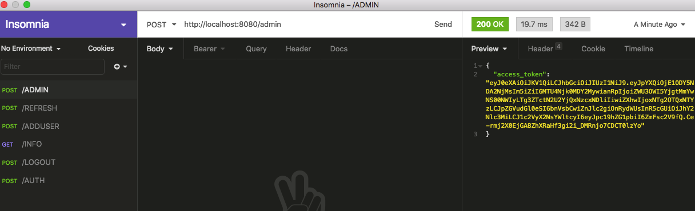

# FBK - Docker + Flask + RESTful + SQLite

L’applicazione descritta in seguito deve essere resa disponibile attraverso un repository git pubblico che comprenda tutti i file necessari al progetto (programma python, dockerfile, docker-compose e continuous integration) ed un file README che descriva nel dettaglio il lavoro svolto in tutti i passaggi, gli strumenti utilizzati, le procedure da seguire per eseguire l’applicazione e le istruzioni per testarne il funzionamento.
Verranno valutati tutti gli aspetti della consegna: dall’implementazione alla documentazione e all’uso di tutti gli strumenti scelti, con particolare attenzione alla sicurezza nell’implementazione di tutti i passaggi e componenti.

## Principali componenti 

Flask è un framework basato su Python. È un micro-framework utilizzato dagli sviluppatori Python per creare API. Si chiama micro framework perché consente agli sviluppatori, ad esempio, di aggiungere autenticazione personalizzata e qualsiasi altro sistema di back-end in base alle preferenze.

I principali componeneti utilizzati sono:

- Flask (1.1.2)
- Docker (alpine:latest) 
- Python 3.7.3
- Insomnia (API Testing Tools) 
- Database Service (SQLite) connettore SQL Alchemy (app.config['SQLALCHEMY_DATABASE_URI'] = 'sqlite:///data.db')

## Descrizione 

E' stato sviluppato un servizio di database utilizzando il db SQLite che permette agli utenti di accedervi tramite un'API REST utilizzando metodi HTTP come POST, PUT e GET. 

## Token Web JSON 

Il token Web JSON, noto anche come JWT , è il modo sicuro di trasferire token casuali tra due parti o entità. JWT è uno standard Open per creare chiavi (token) di accesso tra un server e un client.
JSON è generalmente composto da tre parti come segue: 

- Payload
- Header
- Signature

E' stato utilizzato JWT per creare un server web Flask con autorizzazione JWT. JWT diventa uno standard di autorizzazione e comunicazione tra SPA e web server.Viene utilizzato per gestire l'autenticazione in Flask con l'utilizzo della libreria flask-jwt-extended. flask-jwt-extended è un’estensione di flask per gestire l’autenticazione usando JWT.

Un JWT è un token Web JSON, è un insieme di dati codificati in una lunga stringa. I dati codificati contengono elementi come:

Un isscampo, che viene generalmente utilizzato per identificare in modo univoco l'utente che ha generato questo JWT;
Un jticampo, che è un identificatore univoco per questo JWT (non per l'utente!);
Un algcampo, che definisce quale algoritmo è stato utilizzato per codificare questo JWT;
Un expcampo, che contiene un timestamp della data di scadenza di questo JWT;
Dati arbitrari che vogliamo includere in esso (chiamati "reclami").

flask-jwt-extended:  https://flask-jwt-extended.readthedocs.io/en/stable/

-> user.py

from flask_jwt_extended import

    1. create_access_token,            
    2. create_refresh_token,           
    3. jwt_refresh_token_required,     
    4. get_jwt_identity,               
    5. jwt_required,
    6. get_raw_jwt,
    7. get_jwt_claims

1. CREAZIONE ACCESS TOKEN;
2. CREAZIONE REFRESH TOKEN;
3. DECORATORE PER PROTEGERRE UN ENDPOINT  (si assicurerà che il richiedente abbia un token di aggiornamento valido prima di 
   consentire la chiamata dell'endpoint);
4. RESTITUISCE L'IDENTITA' DEL JWT che accede a questo endpoint. Se non è presente alcun JWT, viene invece restituito 
   "None";
5. TOKEN ACCESSO VALIDO REQUISITO  Se si decora un endpoint con questo, si assicurerà che il richiedente abbia 
   un token di accesso valido prima di consentire la chiamata dell'endpoint. Ciò non controlla la validità del token di 
   accesso;
6. CREAZIONE ENDPOINT PROTETTO questo restituirà il dizionario Python che ha tutte le rivendicazioni del JWT che accede 
   all'endpoint. Se non è presente alcun JWT, viene invece restituito un dict vuoto;
7. CLAIMS RESTITUISCE IL DIZIONARIO delle attestazioni personalizzate nel JWT che accede all'endpoint
   Se non sono presenti richieste personalizzate dell'utente, viene invece restituito un dict vuoto.

## REST APIs with Flask and Python

L'API (interfaccia di programmazione dell'applicazione) consente la comunicazione tra due applicazioni per recuperare o inviare i dati. Flask-RESTful è un'estensione per Flask che aggiunge il supporto per la creazione rapida di API REST. È un'astrazione leggera che funziona con i tuoi ORM / librerie esistenti.

Librerie utilizzate per la creazione REST APIs: 

     1.from flask_restful import Api
     2.from flask_restful import Resource, reqparse 
     3.from werkzeug.security import safe_str_cmp
     4.from blacklist import BLACKLIST
     
     

## Struttura della nostra API REST

     STRUTTURA FILE PROGETTO

app.py:
In app.pyinizializzeremo e configureremo la nostra applicazione Flask. Configureremo anche le nostre risorse API.
Questo file è il punto di accesso alla nostra API REST;
_______
db.py:
In questo file creeremo il nostro oggetto database Python;

_________________________
cartella models/user.py:
UserModel è la definizione dei dati finale nella nostra API. 
Contengono: id; user; password; info;

____________________________
cartella resources/user.py: 
Queste risorse sono abbastanza diverse dalle altre due perché non si occupano solo della creazione e dell'aggiornamento dei dati nella nostra applicazione, ma si occupano anche delle specifiche migliorative di vari flussi di utenti come autenticazione, aggiornamento token, disconnessione e altro ancora.
- In caso di login/password errati deve restituire un errore
- In caso di token sbagliato deve restituire errore
- Il token deve avere una validità temporale limitata (esempio 10 minuti)
- In alternativa alla scadenza temporale del token un endpoint: /logout per chiudere la sessione
  ed annullare il token dell’utente

  
## Approfondimento: risorse dell'utente

Esistono più risorse utente, ognuna con solo uno o due metodi.

La maggior parte di queste risorse risponde alle POST richieste in quanto è il metodo utilizzato per rispondere a dati arbitrari e non necessariamente per creare modelli e salvarli nel nostro server. 

    Create Admin con l’utente admin e relativa password (Token)

    api.add_resource(TokenAdmin, '/admin')

 
 L'utente Admin con la relativa password (token) viene creato facendo una richiesta POST. 
 
 POST ->  http://localhost:8080/admin
 
 

 

    Inserire attraverso il webservice (all’endpoint: /adduser ) un nuovo utente con i campi user, password e info (nel  
    database)
    
    api.add_resource(UserRegister, '/adduser')

L'Admin attraverso la richesta POST -> http://localhost:8080/adduser crea un nuovo utente inviando un JSON con i seguenti campi (user, password e info) per la creazione di un nuovo utente nel db. 
Un messaggio di errore avverte l'utente ADMIN della revoca del token (password admin) "The token has expired."

L'Admin per creare un nuovo utente deve possedere la password (token) valida di tipo Bearer e inserila nel campo TOKEN: 
Un messaggio 201 avverte che il nuovo utente è stato creato. "message": "User created successfully."

    Effettuare una richiesta verso il webservice (endpoint: /info ) usando il token preventivamente ricevuto per avere le         informazioni sull’utente
    
    api.add_resource(User, '/info/<int:user_id>')

Effettuando una richiesta all'endpoint /info http://localhost:8080/info/1 e inserendo dopo /info/n (n=1) si ha il primo utente e con (n=2) si ha il secondo utente (n=3) si ha il terzo ... E' necessario inserire il token valido nel campo TOKEN di tipo Bearer, se l'utente non inserisce il token un messaggio di errore: error": "invalid_token", "message": "Signature verification failed." 401 avvisa l'utente. Una volta inserto un token valido è possibile visualizzare le informazioni sull'utente. 

    Autenticazione dei normali utenti (non admin) verso il webservice (all’endpoint: /auth ) 

    api.add_resource(UserLogin, '/auth')

    Token refresh

api.add_resource(TokenRefresh, '/refresh')

    logout per chiudere la sessione ed annullare il token dell’utente

api.add_resource(UserLogout, '/logout')

